# Homelab Hardening: Root-Only Autonomous Agent Host

> A process documentation repo for hardening a spare workstation into a dedicated, root-only autonomous agent machine with explicit LAN containment, observability, and recovery discipline.

## TL;DR

This project documents how I hardened an Ubuntu Server 26.04 host behind a dedicated third router, with containment enforced on the host through `nftables` (`deny+log` for outbound RFC1918), access restricted to Tailscale SSH, and layered visibility from CrowdSec plus optional AdGuard/Suricata branches.

The runtime model is intentionally high-trust and single-operator: Hermes Agent runs host-native as `root` for maximum autonomy. The architectural trade-off is explicit: local root compromise is in-scope risk, while lateral movement into the upstream home LAN is what the design aggressively blocks and monitors.

## What This Repo Is

- A reproducible, phase-based build log with actual commands ran, expected outputs, issues encountered, and fixes applied.
- An artifact focused on decisions, trade-offs, failures, and fixes.
- A practical hardening pattern for autonomous local agent workflows.

## Architecture At A Glance



```text
Internet -> Router 1 (ISP) -> Router 2 (main LAN) -> Router 3 (dedicated)
                                                       |
                                                       v
                                                  Ubuntu Server 26.04
                                                  |- root-only operator model
                                                  |- Hermes Agent (host-native)
                                                  |- Tailscale SSH admin path
                                                  |- nftables RFC1918 containment
                                                  |- CrowdSec baseline (+ optional AdGuard/Suricata)
                                                  `- optional support containers (Podman/Gluetun)
```

## Access And Trust Model

- Remote admin path is Tailscale SSH (`tailscale ssh root@homelab`) with ACL enforcement (`tag:client` -> `tag:server`, user `root`).
- The installer-mandated bootstrap user is removed in Phase 03; steady state is root-only.
- `sshd` is not LAN-exposed in steady state; when used for break-glass, it is key-only and temporary.
- Public exposure is not baseline; tailnet-only exposure is preferred when remote access is needed.
- Containment objective is **upstream LAN protection**, not local isolation from a trusted root runtime.

## Traffic Flow And Security Checkpoints



- If Phase 08 is enabled, DNS flows through AdGuard for domain-level blocking.
- Outbound LAN-private traffic is dropped and logged by `nftables`.
- Tailscale provides encrypted admin access without router port-forwards.
- CrowdSec adds host-level detection and automated blocking.
- Optional Suricata increases visibility at measurable CPU/memory cost.

## Phase Index

| # | Phase | Time |
| --- | --- | --- |
| 00 | [Threat model and scope](docs/00-threat-model.md) | ~0m |
| 01 | [Network isolation with Router 3](docs/01-network-router3.md) | ~30m |
| 02 | [BIOS and Ubuntu install](docs/02-bios-and-os-install.md) | ~90m |
| 03 | [Root-only remote access bootstrap](docs/03-first-boot-ssh.md) | ~25m |
| 04 | [Wake-on-LAN and power recovery](docs/04-wake-on-lan.md) | ~30m (optional) |
| 05 | [Host hardening baseline](docs/05-host-hardening.md) | ~30m |
| 06 | [nftables containment policy](docs/06-nftables-firewall.md) | ~30m |
| 07 | [Podman and NVIDIA support stack](docs/07-podman-nvidia.md) | ~45m (optional; required before 08-10) |
| 08 | [AdGuard DNS sinkhole](docs/08-adguard-dns.md) | ~30m (requires 07) |
| 09 | [VPN egress for auxiliary workloads](docs/09-vpn-egress.md) | ~45m (optional) |
| 10 | [Suricata IDS (visibility-first)](docs/10-suricata-ids.md) | ~30m (optional; requires 08) |
| 11 | [CrowdSec HIDS baseline](docs/11-crowdsec.md) | ~20m (requires 06) |
| 12 | [Hermes Agent deployment on root host](docs/12-hermes-deployment.md) | varies (requires 01, 02, 03, 05, 06, 11) |
| 13 | [Audit, maintenance, and recovery](docs/13-audit-maintenance.md) | ~60m |

Execution profiles:

- Core/performance-first path: `00 -> 01 -> 02 -> 03 -> 05 -> 06 -> 11 -> 12 -> 13`
- Visibility-first branch: add `07 -> 08` and optionally `09 -> 10`

See `docs/00-threat-model.md` for dependency and optional-branch logic.

## Documentation Conventions

- RFC1918 addresses are retained as-is in docs (`192.168.x.x`, `10.x.x.x`, `172.16-31.x.x`).
- Public IPs should be sanitized to `203.0.113.x`.
- Secrets, tokens, passphrases, and raw auth artifacts are never committed.
- Run `scripts/sanitize-check.sh` before committing changes.

## Hardware And Software Stack

### Hardware

- PC: Intel i9-7920X, 32 GB RAM, 256 GB NVMe + 2 TB HDD, GTX 1080 Ti.
- Routers: Huawei HG8143A5 (ISP), WS7206 (main LAN), WS7100 (dedicated agent gateway).
- Client: MacBook Air M1 (SSH/admin workstation).

### Software

| Layer | Selection |
| --- | --- |
| OS | Ubuntu Server 26.04 LTS |
| Admin path | Tailscale SSH |
| Agent runtime | Hermes Agent (host-native, root) |
| Firewall | nftables |
| DNS filtering | AdGuard Home (optional branch via Phase 08) |
| Host IDS | CrowdSec |
| Network IDS | Suricata (optional profile branch) |
| Optional container branch | Podman + Gluetun |
| Hardening controls | AppArmor, auditd, AIDE, unattended-upgrades |

## Scope Boundaries

- Not a zero-trust multi-tenant architecture.
- Not independent enforcement after trusted local root compromise.
- Not a public SaaS hosting pattern.
- Not enterprise SOC-grade security.
- Not a set-and-forget setup; recurring maintenance is required.

## Lessons Learned

- Router segmentation alone was insufficient; host firewall policy is the real containment control.
- Keeping the runtime host-native simplified operations versus pretending strong local sandboxing.
- Tailscale ACL discipline mattered as much as Linux-side hardening.
- Suricata provided useful visibility but was the first candidate to disable in performance-focused runs.
- Documented break-glass and rollback steps reduced stress during outages and lockout testing.

## Repo Layout

```text
docs/      phase-by-phase process documentation with reproducible commands
configs/   sanitized templates used by phases
scripts/   helper scripts (sanitization, RFC1918 alert checks)
diagrams/  network and traffic-flow visuals (Mermaid + SVG)
```

## License

[MIT](LICENSE)
