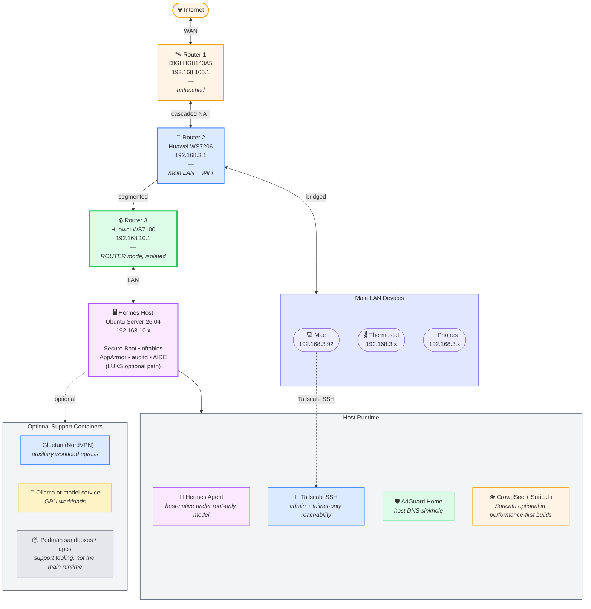

# Network topology diagram

Mermaid source — renderable in GitHub directly, or export to SVG via mermaid-cli.



## How to render

GitHub renders this automatically. For other use:

```bash
# Install mermaid-cli
npm install -g @mermaid-js/mermaid-cli

# Render
mmdc -i network-topology.md -o network-topology.svg
```

## What this diagram shows

- The cascade of NAT routers (R1 → R2 → R3) creating isolation through subnet boundaries
- Router 3 highlighted in green as the security boundary
- The agent host as the main runtime, with optional support containers shown separately
- Tailscale SSH as the operator-admin path and the tailnet-only reachability surface
- Main LAN devices (phones, thermostat, Mac) physically cannot reach the host except through the intended Tailscale/admin path and established outbound flows
