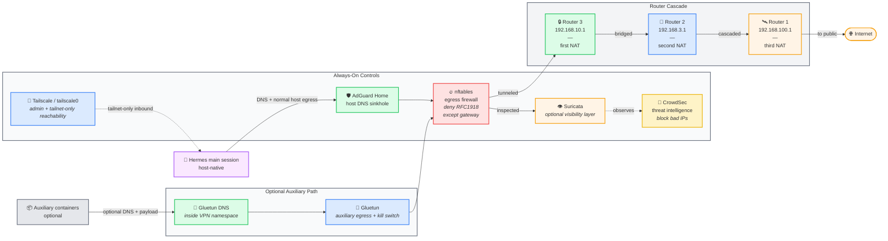

# Traffic flow diagram

Shows the two relevant paths now: the host-native Hermes main session, and the optional auxiliary-container path through Gluetun.

## Defense-in-depth checkpoints

| # | Checkpoint | What it stops | What it doesn't stop |
| --- | --- | --- | --- |
| 1 | **AdGuard Home** | Known malicious, phishing, and unwanted domains at the host resolver | Direct IP connections; brand-new malicious domains |
| 2 | **Optional Gluetun path** | Home-IP exposure and ISP visibility for selected auxiliary workloads | The host-native main session unless you intentionally route it elsewhere |
| 3 | **nftables** | Outbound RFC1918 lateral movement and unwanted physical-LAN inbound | Connections to public Internet |
| 4 | **Tailscale** | Gives a controlled tailnet-only admin and service surface | Public exposure if you deliberately publish beyond the tailnet |
| 5 | **Suricata IDS** | (alerts only) Known exploit/C2/scan patterns when enabled | Zero-day signatures; anything you disable for performance |
| 6 | **CrowdSec** | Inbound from community-flagged bad IPs | First-time-seen attackers; targeted attacks |
| 7 | **Router 3 NAT** | Unsolicited inbound from the main LAN | Outbound from the agent host |

Each layer is independent — bypassing one doesn't bypass the others.

> The main Hermes session normally uses the host network and the host resolver. It does not automatically inherit the Gluetun path.
